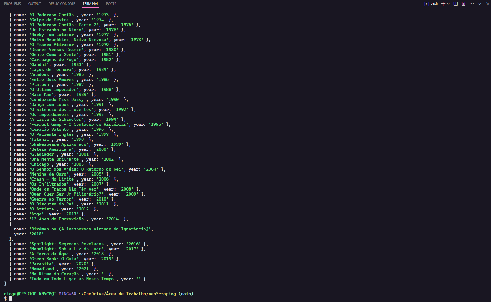

### WEB Scraping

Simple web scraping project where data from a specific website is obtained and rendered in the console

The specific website for this project was Wikipedia, where data from a table with Oscar-winning films from every year to the present date is analyzed.

Below we can see an image of the data being rendered in the console after running the command `node index.js`

 

To install dependencies: `npm install`  
To run command: `node index.js`